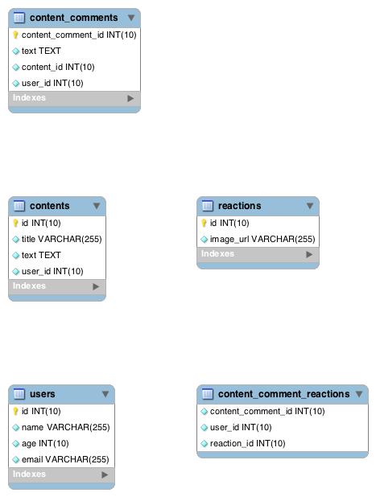
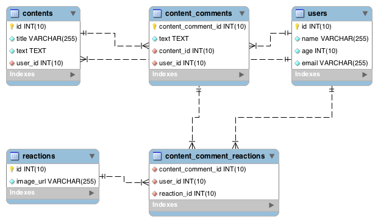

# hakagi

HAKAGI(葉鍵, Leaf and Key) is RDB analyzer that detects implicit foreign key constraints and others to support ER diagram auto-generation

## Installation

```
$ go get -u github.com/syucream/hakagi/cmd/hakagi
```

## Usage

```
$ ./hakagi -dbuser <DB user> -dbpass <DB password> -dbhost <DB host, default:localhost> -dbport <DB port, default:3306> -targets <database name>
```

## Example

- This query doesn't have foreign key constraints:

```
$ cat examples/example.sql
CREATE TABLE IF NOT EXISTS users (
  id    INT UNSIGNED NOT NULL AUTO_INCREMENT,
  name  VARCHAR(255) NOT NULL,
  age   INT UNSIGNED NOT NULL,
  email VARCHAR(255) NOT NULL,
  PRIMARY KEY(id)
) ENGINE=InnoDB DEFAULT CHARSET=utf8;

CREATE TABLE IF NOT EXISTS contents (
  id    INT UNSIGNED NOT NULL AUTO_INCREMENT,
  title VARCHAR(255) NOT NULL,
  text  TEXT NOT NULL,
  user_id INT UNSIGNED NOT NULL,
  PRIMARY KEY(id)
) ENGINE=InnoDB DEFAULT CHARSET=utf8;

CREATE TABLE IF NOT EXISTS content_comments (
  content_comment_id INT UNSIGNED NOT NULL AUTO_INCREMENT,
  text               TEXT NOT NULL,
  content_id         INT UNSIGNED NOT NULL,
  user_id            INT UNSIGNED NOT NULL,
  PRIMARY KEY(content_comment_id)
) ENGINE=InnoDB DEFAULT CHARSET=utf8;

CREATE TABLE IF NOT EXISTS content_comment_reactions (
  content_comment_id INT UNSIGNED NOT NULL,
  user_id            INT UNSIGNED NOT NULL,
  reaction_id        INT UNSIGNED NOT NULL
) ENGINE=InnoDB DEFAULT CHARSET=utf8;

CREATE TABLE IF NOT EXISTS reactions (
  id        INT UNSIGNED NOT NULL AUTO_INCREMENT,
  image_url VARCHAR(255) NOT NULL,
  PRIMARY KEY(id)
) ENGINE=InnoDB DEFAULT CHARSET=utf8;
```

- So you might not generate ER diagram automatically



- `hakagi` guesses the relations based on table/column names:

```
$ ./hakagi -dbuser root -targets hakagi_example
ALTER TABLE content_comment_reactions ADD CONSTRAINT FOREIGN KEY (content_comment_id) REFERENCES content_comments(content_comment_id);
ALTER TABLE content_comment_reactions ADD CONSTRAINT FOREIGN KEY (user_id) REFERENCES users(id);
ALTER TABLE content_comment_reactions ADD CONSTRAINT FOREIGN KEY (reaction_id) REFERENCES reactions(id);
ALTER TABLE content_comments ADD CONSTRAINT FOREIGN KEY (content_id) REFERENCES contents(id);
ALTER TABLE content_comments ADD CONSTRAINT FOREIGN KEY (user_id) REFERENCES users(id);
ALTER TABLE contents ADD CONSTRAINT FOREIGN KEY (user_id) REFERENCES users(id);
```

- You might get auto-generated diagram with the relations:

```
$ ./hakagi -dbuser root -targets hakagi_example > migration01.sql
$ mysql -u root hakagi_example < migration01.sql
```



## TODO

- Support more guess roles
- Support more output formats(e.g. plantuml?)
